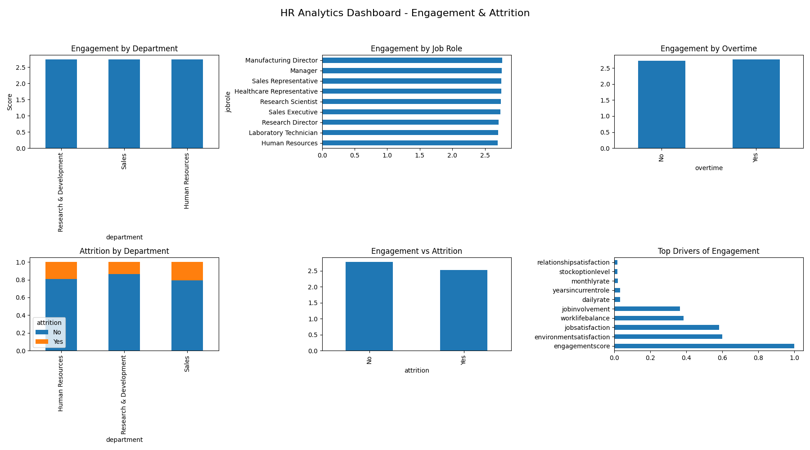

# 📊 HR Analytics: Employee Engagement & Attrition

## 🚀 Project Overview

This project analyzes employee engagement and attrition patterns to identify key drivers of workforce turnover and provide actionable HR insights.

## 🎯 Objectives

* Measure employee engagement using multiple satisfaction indicators
* Identify high-risk attrition groups
* Analyze key drivers impacting engagement and retention
* Build a visual dashboard for decision-making

---

## 🖼️ Dashboard Preview



---

## 🛠️ Tech Stack

* **Python** (Pandas, Matplotlib)
* **PostgreSQL**
* **VS Code**

---

## 📊 Key Features

* 🔹 Engagement Score Calculation
* 🔹 Department & Job Role Analysis
* 🔹 Attrition Trend Analysis
* 🔹 Overtime Impact Study
* 🔹 Correlation & Driver Analysis
* 🔹 One-page Analytics Dashboard

---

## 🔍 Key Insights

### 1. Overtime Drives Attrition

Employees working overtime show significantly lower engagement and higher attrition rates.

### 2. Engagement is a Leading Indicator

Employees with low engagement scores are more likely to leave the organization.

### 3. Early Tenure Risk

New employees have a higher probability of attrition, indicating onboarding challenges.

### 4. Department-Level Risk

Certain departments consistently show low engagement and high attrition.

---

## 💡 Business Recommendations

* Improve work-life balance policies
* Reduce overtime dependency
* Strengthen onboarding experience
* Monitor engagement at department level

---

## 📂 Project Structure

```
├── data/
├── notebooks/
├── scripts/
├── dashboard/
├── README.md
└── requirements.txt
```

---

## ▶️ How to Run

```bash
pip install -r requirements.txt
python scripts/analysis.py
```

---

## 👤 Author

Prajjwol Kansakar
